# 📈 API Alert System

A comprehensive, modular stock price monitoring system that tracks your favorite stocks and sends alerts when prices cross your defined thresholds. Built with Python, PostgreSQL, and multiple notification systems including Telegram and NTFY. Features a **Model Context Protocol (MCP) server** for AI/LLM integration.

## 🏗️ Project Structure

```
api-alert-system/
├── src/
│   └── api_alert_system/          # Main package
│       ├── core/                  # Core functionality
│       │   ├── alert_bot.py       # Main alert bot
│       │   ├── database.py        # Database operations
│       │   └── stock_monitor.py   # Stock price monitoring
│       ├── notifications/         # Notification systems
│       │   ├── telegram.py        # Telegram notifications
│       │   ├── ntfy.py           # NTFY notifications
│       │   └── console.py        # Console notifications
│       ├── mcp/                  # Model Context Protocol
│       │   ├── server.py         # MCP server implementation
│       │   └── client.py         # MCP client for testing
│       └── utils/                # Utilities
│           ├── config.py         # Configuration
│           └── helpers.py        # Helper functions
├── scripts/                      # Utility scripts
│   ├── setup_db.py              # Database setup
│   ├── inspect_db.py            # Database inspection
│   └── setup.py                 # General setup
├── tests/                       # Test files
│   ├── test_mcp_server.py       # MCP server tests
│   └── test_telegram.py        # Telegram tests
├── demos/                       # Demo applications
├── backups/                     # Backup versions
├── docs/                        # Documentation
│   ├── MCP_README.md           # MCP integration guide
│   ├── NTFY_SETUP.md           # NTFY setup guide
│   └── QUICKSTART.md           # Quick start guide
├── docker/                      # Docker files
├── data/                        # Data files
├── stock_alert_mcp_server.py    # Standalone MCP server
├── test_stdio_mcp.py           # MCP server test script
└── main.py                      # Main entry point
```

## 🏛️ System Architecture

```mermaid
graph TB
    %% External APIs and Services
    subgraph "External Services"
        YF[Yahoo Finance API<br/>yfinance]
        TG[Telegram Bot API]
        NT[NTFY Server]
        AI[AI/LLM Clients<br/>Claude Desktop, etc.]
    end
    
    %% Core Application Components
    subgraph "API Alert System"
        subgraph "Core Engine"
            AB[Alert Bot<br/>Main Controller]
            SM[Stock Monitor<br/>Price Fetcher]
            DB[(PostgreSQL<br/>Database)]
        end
        
        subgraph "Notification Layer"
            TG_N[Telegram<br/>Notifier]
            NT_N[NTFY<br/>Notifier]
            CN_N[Console<br/>Notifier]
        end
        
        subgraph "Configuration & Utils"
            CFG[Config Manager<br/>Watchlist & Settings]
        end
        
        subgraph "MCP Integration Layer"
            MCP[MCP Server<br/>Model Context Protocol]
            TOOLS[MCP Tools<br/>9 Stock Management Tools]
            RES[MCP Resources<br/>Config & Status Data]
        end
    end
    
    %% MCP Testing Infrastructure
    subgraph "Testing & Validation"
        STDIO[STDIO Transport<br/>✅ Tested & Working]
        HTTP[HTTP Transport<br/>⚠️ Configuration Issues]
        INSPECTOR[MCP Inspector<br/>Testing Tool]
        TEST[Test Scripts<br/>Automated Validation]
    end
    
    %% Data Flow - Core System
    YF -->|Stock Prices| SM
    SM -->|Price Data| AB
    AB -->|Store Data| DB
    AB -->|Check Thresholds| CFG
    AB -->|Send Alerts| TG_N
    AB -->|Send Alerts| NT_N
    AB -->|Send Alerts| CN_N
    TG_N -->|HTTP POST| TG
    NT_N -->|HTTP POST| NT
    
    %% Configuration Flow
    CFG -->|Watchlist & Settings| AB
    CFG -->|Thresholds| AB
    
    %% MCP Integration Flow
    MCP -->|Query Interface| AB
    MCP -->|Data Access| DB
    MCP -->|Config Access| CFG
    MCP -->|Expose Tools| TOOLS
    MCP -->|Expose Resources| RES
    
    %% External MCP Access
    AI -->|MCP Protocol| MCP
    AI -->|Tool Calls| TOOLS
    AI -->|Resource Access| RES
    
    %% Testing Flow
    TEST -->|Validate| STDIO
    TEST -->|Validate| HTTP
    INSPECTOR -->|Inspect| MCP
    STDIO -->|Transport| MCP
    HTTP -->|Transport| MCP
    
    %% Styling
    classDef external fill:#e1f5fe,stroke:#01579b,stroke-width:2px
    classDef core fill:#f3e5f5,stroke:#4a148c,stroke-width:2px
    classDef notification fill:#e8f5e8,stroke:#1b5e20,stroke-width:2px
    classDef config fill:#fff3e0,stroke:#e65100,stroke-width:2px
    classDef database fill:#fce4ec,stroke:#880e4f,stroke-width:2px
    classDef mcp fill:#f1f8e9,stroke:#33691e,stroke-width:2px
    classDef testing fill:#fff8e1,stroke:#f57f17,stroke-width:2px
    classDef working fill:#e8f5e8,stroke:#2e7d32,stroke-width:3px
    classDef issues fill:#ffebee,stroke:#c62828,stroke-width:2px
    
    class YF,TG,NT,AI external
    class AB,SM core
    class TG_N,NT_N,CN_N notification
    class CFG config
    class DB database
    class MCP,TOOLS,RES mcp
    class INSPECTOR,TEST testing
    class STDIO working
    class HTTP issues
```



## 🔄 Data Flow Overview

### Core System Flow
1. **Price Monitoring**: `Stock Monitor` fetches real-time prices from Yahoo Finance API
2. **Threshold Checking**: `Alert Bot` compares current prices against configured thresholds
3. **Data Storage**: All price data and alert history stored in PostgreSQL database
4. **Notification Dispatch**: When thresholds are crossed, alerts sent to multiple channels
5. **Configuration Management**: Centralized config handles watchlist and system settings

### MCP Integration Flow
6. **MCP Server**: Exposes stock management functionality via Model Context Protocol
7. **Tool Interface**: 9 specialized tools for stock management and monitoring
8. **Resource Access**: Real-time access to configuration and system status
9. **AI Integration**: External AI/LLM clients can interact with the system via MCP
10. **Testing Validation**: Comprehensive testing ensures MCP functionality works correctly

## 🧪 MCP Server Testing & Validation

### ✅ Verified Working Components

The MCP server has been thoroughly tested using the official MCP Inspector methodology:

#### **STDIO Transport - ✅ FULLY FUNCTIONAL**
```bash
# Test the MCP server via STDIO transport
python test_stdio_mcp.py
```

**Test Results:**
- ✅ **Connection**: Successfully connects via stdio transport
- ✅ **Tools**: All 9 tools properly exposed and functional
- ✅ **Resources**: 2 resources accessible (config & status)
- ✅ **Real Data**: Successfully fetches live stock prices
- ✅ **Demo Mode**: Mock data mode works for testing
- ✅ **Error Handling**: Graceful error handling for invalid inputs

#### **Available MCP Tools (9 Total)**
1. `add_stock_to_watchlist` - Add stocks with price thresholds
2. `remove_stock_from_watchlist` - Remove stocks from monitoring  
3. `update_stock_thresholds` - Update price thresholds
4. `get_current_prices` - Fetch current stock prices
5. `check_alert_conditions` - Check threshold violations
6. `get_price_history` - Retrieve historical price data
7. `get_alert_history` - Retrieve alert history
8. `get_watchlist_status` - Get complete watchlist status
9. `toggle_demo_mode` - Enable/disable demo mode

#### **Available MCP Resources (2 Total)**
1. `mcp://stock-alerts/watchlist_config` - Current watchlist configuration
2. `mcp://stock-alerts/system_config` - System settings and status

### 🔧 Testing Commands

#### **Quick MCP Test**
```bash
# Run comprehensive MCP server test
python test_stdio_mcp.py
```

#### **Manual MCP Server Start**
```bash
# Start MCP server (stdio mode)
python stock_alert_mcp_server.py

# Start MCP server (HTTP mode - experimental)
python stock_alert_mcp_server.py --transport streamable-http --host 127.0.0.1 --port 8000
```

#### **Using MCP Inspector Tool**
```bash
# Install MCP Inspector
npm install -g @modelcontextprotocol/inspector

# Test HTTP transport (if working)
mcp-inspector http://127.0.0.1:8000/mcp

# Test stdio transport
mcp-inspector python stock_alert_mcp_server.py
```

### ⚠️ Known Issues

#### **HTTP Transport**
- **Status**: Configuration issues detected
- **Issue**: Server starts but doesn't bind to port 8000
- **Workaround**: Use STDIO transport (fully functional)
- **Investigation**: Likely FastMCP version compatibility issue

### 🏗️ Component Responsibilities

| Component | Responsibility | MCP Integration |
|-----------|----------------|-----------------|
| **Alert Bot** | Main orchestrator, threshold checking, alert coordination | ✅ Exposed via MCP tools |
| **Stock Monitor** | Price fetching, API integration, data validation | ✅ Accessible through MCP |
| **Database** | Persistent storage, historical data, alert logging | ✅ Query via MCP tools |
| **Notification Layer** | Multi-channel alert delivery (Telegram, NTFY, Console) | ✅ Status via MCP resources |
| **Config Manager** | Watchlist management, threshold settings, environment config | ✅ Full MCP access |
| **MCP Server** | External API interface for AI/ML integration | ✅ Tested & validated |

## ✨ Features

- 📊 **Real-time Stock Monitoring**: Uses Yahoo Finance API via `yfinance`
- 🚨 **Customizable Alerts**: Set upper and lower price thresholds
- 💾 **Historical Data**: PostgreSQL database stores all price history
- 📱 **Multiple Notifications**: Telegram, NTFY, and console notifications
- 🤖 **MCP Integration**: Full Model Context Protocol server for AI/LLM integration
- 🧪 **Tested MCP Server**: Comprehensive testing with MCP Inspector methodology
- 🐳 **Docker Ready**: Easy containerized deployment
- 🎬 **Demo Mode**: Test with mock data before going live
- 📈 **Alert History**: Track all alerts sent over time
- 🔧 **Modular Design**: Clean, maintainable code structure

## 🚀 Quick Start

### 1. Clone and Install

```bash
git clone <your-repo>
cd api-alert-system

# Install dependencies
pip install -e .

# Or install with development dependencies
pip install -e ".[dev]"
```

### 2. Configure Your Watchlist

Edit `src/api_alert_system/utils/config.py`:

```python
WATCHLIST = {
    "AAPL": {"upper": 200.00, "lower": 175.00},
    "TSLA": {"upper": 300.00, "lower": 200.00},
    "SPY": {"upper": 500.00, "lower": 450.00},
}
```

### 3. Set Up Environment Variables

Create a `.env` file:

```bash
# PostgreSQL Configuration
POSTGRES_HOST=localhost
POSTGRES_PORT=5432
POSTGRES_DB=stock_alerts
POSTGRES_USER=postgres
POSTGRES_PASSWORD=your_password_here

# Telegram Configuration (Optional)
TELEGRAM_TOKEN=your_bot_token_here
TELEGRAM_CHAT_ID=your_chat_id_here

# NTFY Configuration (Optional)
NTFY_TOPIC=your-unique-topic-name
NTFY_SERVER=https://ntfy.sh

# System Configuration
DEMO_MODE=False
POLL_INTERVAL=10
```

### 4. Initialize Database

```bash
# Using the script
python scripts/setup_db.py

# Or using the entry point
setup-db
```

### 5. Run the System

```bash
# Using the main entry point
python main.py

# Or using the package directly
python -m api_alert_system.core.alert_bot

# Or using the entry point
alert-bot
```

### 6. Test MCP Server

```bash
# Test MCP functionality
python test_stdio_mcp.py

# Start standalone MCP server
python stock_alert_mcp_server.py
```

## 🤖 MCP Integration

### Using with Claude Desktop

Add to your Claude Desktop MCP configuration:

```json
{
  "mcpServers": {
    "stock-alerts": {
      "command": "python",
      "args": ["/path/to/your/project/stock_alert_mcp_server.py"],
      "cwd": "/path/to/your/project"
    }
  }
}
```

### Using with Other MCP Clients

```python
from fastmcp import Client
from fastmcp.client.transports import PythonStdioTransport

async def main():
    transport = PythonStdioTransport("stock_alert_mcp_server.py")
    async with Client(transport) as client:
        # Add a stock
        result = await client.call_tool("add_stock_to_watchlist", {
            "ticker": "AAPL",
            "upper_threshold": 200.0,
            "lower_threshold": 150.0
        })
        print(result)
        
        # Check prices
        result = await client.call_tool("get_current_prices")
        print(result)
```

## 📱 Notification Setup

### Telegram Setup

1. **Create a Bot**:
   - Message [@BotFather](https://t.me/BotFather) on Telegram
   - Send `/newbot` and follow instructions
   - Copy your bot token

2. **Get Your Chat ID**:
   - Message [@userinfobot](https://t.me/userinfobot) 
   - Copy your chat ID

3. **Update Environment**:
   ```bash
   TELEGRAM_TOKEN=your_bot_token_here
   TELEGRAM_CHAT_ID=your_chat_id_here
   ```

### NTFY Setup

1. **Choose a Topic**:
   - Pick a unique topic name (e.g., "your-username-stock-alerts-xyz123")

2. **Subscribe**:
   - Visit https://ntfy.sh/your-topic-name
   - Or use the NTFY app

3. **Update Environment**:
   ```bash
   NTFY_TOPIC=your-unique-topic-name
   NTFY_SERVER=https://ntfy.sh
   ```

## 🎬 Demo Mode

Try the system with mock data:

```bash
# Enable demo mode in .env
DEMO_MODE=True

# Run the system
python main.py

# Test MCP with demo mode
python test_stdio_mcp.py
```

## 🐳 Docker Deployment

### Using Docker Compose

```bash
cd docker
docker-compose up -d
```

### Manual Docker Build

```bash
# Build the image
docker build -f docker/Dockerfile -t api-alert-system .

# Run with environment variables
docker run -d \
  --name api-alerts \
  --env-file .env \
  api-alert-system
```

## 🧪 Testing

### Core System Tests
```bash
# Run all tests
pytest

# Run with coverage
pytest --cov=api_alert_system

# Run specific tests
pytest tests/test_telegram.py
```

### MCP Server Tests
```bash
# Comprehensive MCP server test
python test_stdio_mcp.py

# Test individual MCP components
python tests/test_mcp_server.py

# Manual MCP server validation
python stock_alert_mcp_server.py
```

### Testing Checklist
- ✅ **STDIO Transport**: Fully tested and working
- ✅ **Tool Functionality**: All 9 tools validated
- ✅ **Resource Access**: Configuration and status resources working
- ✅ **Real Data Integration**: Live stock price fetching tested
- ✅ **Demo Mode**: Mock data functionality verified
- ⚠️ **HTTP Transport**: Known configuration issues

## 📚 Documentation

- [Quick Start Guide](docs/QUICKSTART.md)
- [MCP Integration](docs/MCP_README.md)
- [NTFY Setup](docs/NTFY_SETUP.md)

## 🔧 Development

### Project Structure Benefits

- **Modularity**: Each component is isolated and testable
- **Maintainability**: Clear separation of concerns
- **Extensibility**: Easy to add new notification systems
- **Testing**: Dedicated test directory with proper structure
- **Documentation**: Organized documentation in docs/
- **MCP Integration**: Full Model Context Protocol support for AI integration

### Adding New Features

1. **New Notification System**: Add to `src/api_alert_system/notifications/`
2. **New Data Source**: Extend `src/api_alert_system/core/stock_monitor.py`
3. **New Database**: Extend `src/api_alert_system/core/database.py`
4. **New Scripts**: Add to `scripts/` directory
5. **New MCP Tools**: Extend `src/api_alert_system/mcp/server.py`

### Code Quality

```bash
# Format code
black src/ tests/

# Lint code
flake8 src/ tests/

# Type checking
mypy src/
```

### MCP Development

```bash
# Test MCP server during development
python test_stdio_mcp.py

# Debug MCP server
FASTMCP_LOG_LEVEL=DEBUG python stock_alert_mcp_server.py

# Validate MCP protocol compliance
mcp-inspector python stock_alert_mcp_server.py
```

## 🚀 Production Deployment

### MCP Server in Production

For production use with AI/LLM clients:

1. **Claude Desktop Integration**:
   ```json
   {
     "mcpServers": {
       "stock-alerts": {
         "command": "python",
         "args": ["/path/to/stock_alert_mcp_server.py"],
         "cwd": "/path/to/project"
       }
     }
   }
   ```

2. **Environment Setup**:
   - Ensure all dependencies are installed
   - Configure database connection
   - Set up notification channels
   - Test with `python test_stdio_mcp.py`

3. **Monitoring**:
   - Monitor MCP server logs
   - Validate tool functionality regularly
   - Check resource accessibility

## 📄 License

This project is licensed under the MIT License - see the LICENSE file for details.

## 🤝 Contributing

1. Fork the repository
2. Create a feature branch
3. Make your changes
4. Add tests (including MCP tests)
5. Submit a pull request

## 📞 Support

For support and questions:
- Open an issue on GitHub
- Check the documentation in the `docs/` directory
- Review the demo applications in `demos/`
- Test MCP functionality with `python test_stdio_mcp.py`

## 🎯 Roadmap

### Completed ✅
- Core stock monitoring system
- Multiple notification channels
- PostgreSQL integration
- MCP server implementation
- Comprehensive MCP testing
- Docker containerization

### In Progress 🚧
- HTTP transport debugging for MCP server
- Enhanced error handling
- Performance optimizations

### Planned 📋
- Web dashboard interface
- Additional stock data sources
- Advanced alerting rules
- Mobile app integration
- Enhanced MCP tools for portfolio management
